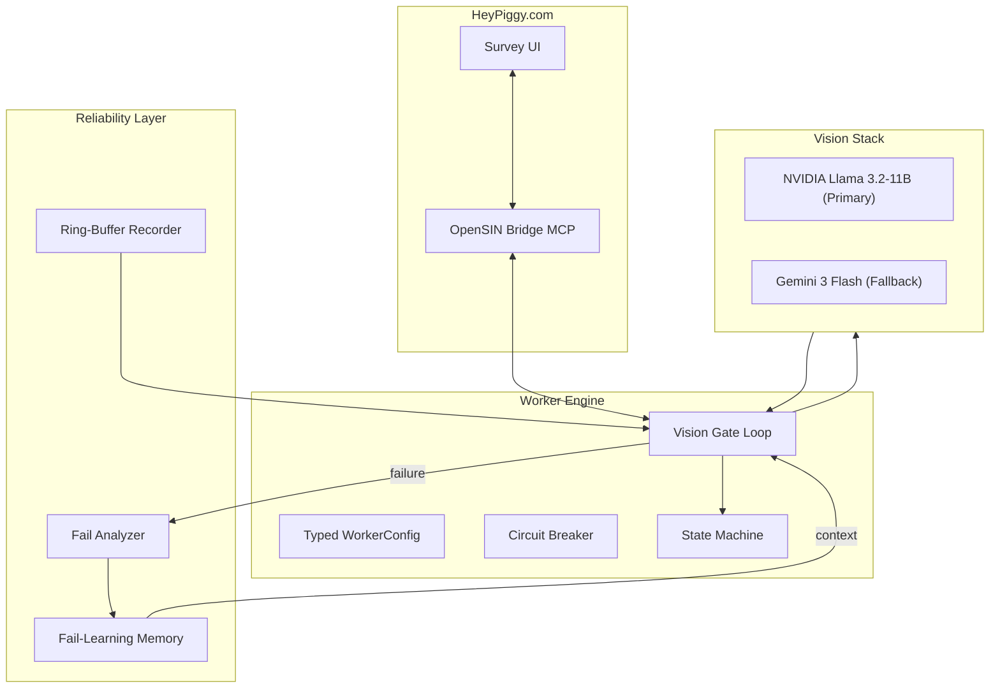

  

  
  
  
  

  <a href="#quick-start">Quick Start</a> ·
  <a href="#features">Features</a> ·
  <a href="#architecture">Architecture</a> ·
  <a href="#fail-learning">Fail Learning</a> ·
  <a href="#observability">Observability</a> ·
  <a href="#contributing">Contributing</a>

  <em>Autonomous HeyPiggy survey worker agent for high-reliability monetization.</em>

---

> [!NOTE]
> HeyPiggy is part of the **OpenSIN-AI** ecosystem. It autonomously completes surveys on the HeyPiggy platform using vision-guided execution and self-healing logic.

---

## What is HeyPiggy?

HeyPiggy is a **Production-Grade Vision Worker** designed to navigate survey platforms with human-like precision. Unlike traditional scrapers, it uses a multi-layered vision stack (NVIDIA Llama 3.2-11B / Gemini 3 Flash) to understand UI state, bypass blockers, and complete surveys autonomously.

---

## Quick Start

<table>
<tr>
<td width="33%" align="center">
<strong>1. Setup</strong>  
<code>git clone OpenSIN-AI/A2A-SIN-Worker-heypiggy</code>  

</td>
<td width="33%" align="center">
<strong>2. Config</strong>  
<code>cp .env.example .env</code> (Add NVIDIA_API_KEY)  

</td>
<td width="33%" align="center">
<strong>3. Run</strong>  
<code>python heypiggy_vision_worker.py</code>  

</td>
</tr>
</table>

---

## Features

| Capability | Description | Status |
|:---|:---|:---:|
| **Vision Gate Loop** | Screenshot-driven navigation with DOM verification | ✅ |
| **Fail-Replay Recorder** | 120s Ring-Buffer recorder for post-failure replay | ✅ |
| **NVIDIA Fail-Analysis** | Multi-frame fail analysis via NVIDIA NIM | ✅ |
| **Self-Healing Memory** | Learns from past failures and adapts runtime actions | ✅ |
| **Circuit Breaker** | Protection against API overload and usage limits | ✅ |
| **Typed Config** | Unified configuration with environment overrides | ✅ |

---

## Architecture

---

## Fail Learning

HeyPiggy doesn't just crash — it learns. Every time a run exits in a failure state:
1. **Keyframes** are extracted from the ring-buffer recorder.
2. **NVIDIA Llama-90B** performs a multi-frame root cause analysis.
3. **Denylists** are updated with bad selectors or action signatures.
4. **Adaptive Delays** are applied to the next run to avoid timing races.

---

## Observability

Every run emits a structured `run_summary.json` including:
- **Step Metrics:** Verdicts, durations, and action success rates.
- **Timing Data:** Average vision and bridge call times.
- **Fail Context:** Terminal exit reasons and final page state.
- **Circuit Status:** Monitoring snapshots of the NVIDIA NIM backend.

---

## Configuration

The worker can be configured via environment variables:

View Environment Variables

| Variable | Default | Description |
|:---|:---|:---|
| `NVIDIA_API_KEY` | (required) | Your NVIDIA NIM API Key |
| `VISION_BACKEND` | `auto` | `auto`, `nvidia`, or `opencode` |
| `MAX_STEPS` | `120` | Maximum steps per run |
| `MAX_RETRIES` | `5` | Retries per vision step |
| `HEYPIGGY_EMAIL` | (required) | Platform login email |
| `HEYPIGGY_PASSWORD` | (required) | Platform login password |

---

## License

Distributed under the **MIT License**. See [LICENSE](LICENSE) for more information.

---

  

  Entwickelt vom <a href="https://opensin.ai"><strong>OpenSIN-AI</strong></a> Ökosystem – Enterprise AI Agents die autonom arbeiten. 
  🌐 <a href="https://opensin.ai">opensin.ai</a> · 💬 <a href="https://opensin.ai/agents">Alle Agenten</a> · 🚀 <a href="https://opensin.ai/dashboard">Dashboard</a>

(<a href="#readme-top">back to top</a>)

