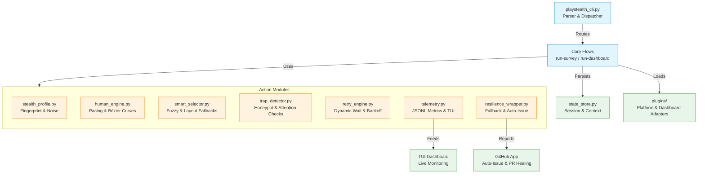

# 🕵️‍♂️ PlayStealth CLI

[](https://pypi.org/project/playstealth-cli/)
[](https://www.python.org/downloads/)
[](https://opensource.org/licenses/MIT)
[](https://github.com/SIN-CLIs/playstealth-cli/actions)
[](https://github.com/astral-sh/ruff)

**Modular Playwright + Stealth CLI for resilient, human-like survey automation & diagnostics.**  
Built on a `1 CLI → many small modules` philosophy. Features advanced anti-detection, human pacing, trap detection, state persistence, telemetry, and self-healing selectors. Designed for authorized testing, QA, and research.

> ⚖️ **Compliance & Responsible Use**  
> This tool is provided for **authorized testing, QA, and educational purposes only**. Automation may violate platform Terms of Service. Always verify platform rules, respect rate limits, and never use for fraudulent reward farming.  
> 📖 Read the full [COMPLIANCE.md & Responsible Use Guide](./COMPLIANCE.md) before running.

---

## 🚀 Quick Start

### Install via `pipx` (Recommended)
```bash
pipx install playstealth-cli
playwright install chromium
```

### First Run
```bash
playstealth --help
playstealth diagnose benchmark
playstealth run-survey --index 0 --max-steps 5
```

### Local Development
```bash
git clone https://github.com/SIN-CLIs/playstealth-cli.git  
cd playstealth-cli
python3 -m venv .venv && source .venv/bin/activate
pip install -e '.[dev]'
playwright install chromium
```

---

## 📖 Core Commands

| Command | Description |
|---------|-------------|
| `playstealth run-survey --index 0 --max-steps 5` | Execute survey with human pacing & trap detection |
| `playstealth resume-survey --max-steps 5` | Resume interrupted session from saved state |
| `playstealth run-dashboard --url <URL> --email <E> --password <P>` | Full loop: Login → Scan → Screen → Complete → Break |
| `playstealth diagnose benchmark` | Run stealth & fingerprint audit (CreepJS/SannySoft checks) |
| `playstealth profile <URL>` | Analyze DOM, extract selectors & generate plugin stub |
| `playstealth tui` | Live terminal dashboard for telemetry & progress |
| `playstealth queue list` | Show prioritized survey queue (€/min filtered) |
| `playstealth manifest` | Generate CLI manifest with plugins, stealth score & config |
| `playstealth state` | View/Manage persisted session states |
| `playstealth create-plugin <name>` | Scaffold new survey/dashboard plugin with tests |

> 💡 All commands support `--auto-report`, `--fail-fast`, and `--no-issue-dedup` for resilience control.

---

## 🏗️ Architecture



---

## 🔧 Configuration & Secrets

PlayStealth follows a **local-first, secret-safe** approach:
- 🔑 **Secrets Management**: Use [Infisical](https://infisical.com/) or local `.env`. Never commit credentials, tokens, or PEM files.
- 📁 **State & Telemetry**: All session data, manifests, and metrics are stored locally in `.playstealth_state/`.
- 🌍 **Environment**: See `.env.example` for all configurable flags (pacing, retries, EPM thresholds, GitHub App IDs).

```bash
# Bootstrap with Infisical (recommended)
export INFISICAL_PROJECT_ID="your_project_id"
export INFISICAL_TOKEN="your_service_token"
playstealth run-dashboard --url "https://..."
```

---

## 🛠️ Development & Testing

```bash
# Run test suite
pytest tests/ -v

# Lint & type check
ruff check .
mypy playstealth_actions/

# Build & publish (maintainers)
python -m build
twine upload dist/*
```

### 🤖 Auto-Healing & Issue Reporting
When a module fails, PlayStealth automatically:
1. Logs telemetry to `.playstealth_state/telemetry.jsonl`
2. Applies a graceful fallback (flow continues)
3. Creates a GitHub Issue via the configured GitHub App
4. If it's a selector/DOM failure, opens an Auto-Heal PR with fallback selectors
> Configure via `GITHUB_APP_*` env vars. Disable with `--no-auto-report`.

---

## 📜 License & Compliance
Distributed under the **MIT License**. See [LICENSE](./LICENSE) for details.  
⚖️ Usage is subject to the [COMPLIANCE.md & Responsible Use Guide](./COMPLIANCE.md).  
Maintained by [SIN-CLIs](https://github.com/SIN-CLIs).

---
*Built for resilience. Designed for humans. Engineered for stealth.* 🔐
